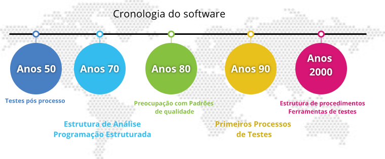
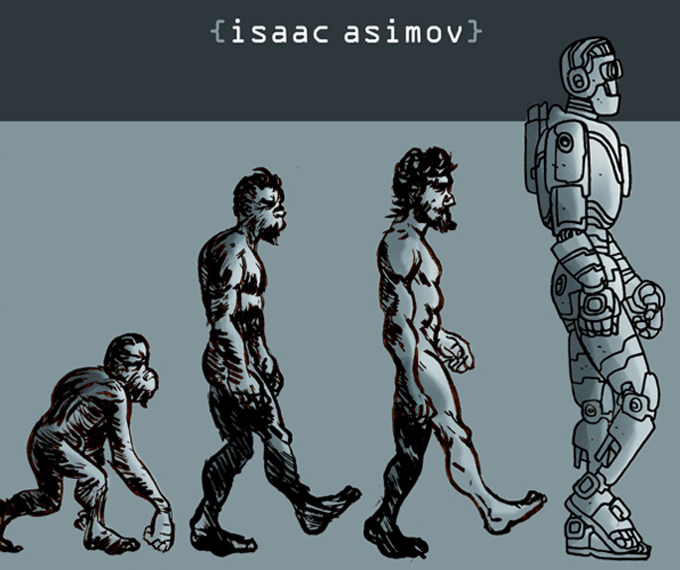

# Preocupação com qualidade de software

## Cronologia do software

Período | Evento
------- | -------
Anos 50 | Erros conhecidos após termino do programa
Anos 70 | Análise / Programação estruturada
Anos 80 | Primeiras preocupações e Padrões com qualidade de software
Anos 90  | Primeiros processos de teste. Motivação bug do milêniio
Anos 2000 | Estruturação do Procedimentos de testes dentro do processo de desenvolvimento. Surgem excelentes ferramentas de testes. Qualidade Total no processo de desenvolvimento e produto de software.

## Crise do software

Fatos Reais - Projetos de software    |  x
------------------------------------- |
+ 30% Projetos de softwares **CANCELADOS** | x
+ 70% Projetos Falham as funcionalidade| x

Custos e prazos extrapolam previsão | x
----------------------------------- |
Custos em mais de 180% | x
Prazos em mais de 200% | x

Custo de desenvolvimento | x
------------------------ |
80% - Identificar e corrigir defeitos de programação | x

### Aspectos relevantes

1.  Software não é tangível. requer abstração para desenvolve-lo
2. Processo de desenvolvimento é executado e gerenciado por pessoas, sendo portanto subjetivo
3. Abastração e subjetividade conferem conferem dificuldade no processo de desenvolvimento.
4.  O software em si é uma consequencia direta da forma (processo) pelo qual foi desenvolvido. **Processo manufaturado**.
5. Processo de desenvolvido eficiênte -> software eficiênte.

Abstrato e subjetivo

## Processo de software

* Conjuntos de atividade,métodos, práticas e tecnologias que as pessoas usam para desenvolver e manter seu software.
* Processo adquado garante que o software será desenvolvido de forma adequada e de maneira organizada, disciplinada e previsível.
* O processo descreve formalmente de maneira organizada e as atividades que deverão ser seguidas para obter um produto software.
* A dificuldade está no gerenciamento do processo (despadronização) que está desenvolvido em várias etapas.

1. **Concepção :**  Avaliar se é viável produzir o software.
  *  Requisitos -> Interesses Soluções para o usuário
2. **Análise e Design :** Arquiterurar; possibilitar.
  * Requisitos tecnologicos -> Tecnologia para usuário
3. **Implementação :** codficar o programa
  * Escrita do código
4. **Testes :** Padrão de qualidade desejado
  * Buscar defeitos e falhas do sistema.
5. **Homologação e aceitação :**  
  * Usuário aprovar o sistema.
5. **Implantação :** Colocar no ambiente do usuário e treina-lo
  * Entregar o sistemas.
  * Fim do ciclo de desenvolvimento.

  ## Onde Estão os defeitos?

* O maior dificuldade está na fase inicial do entendimento do sistema. Requisitos tem um alto grau de abstração + comunicação  com pessoas.

* Segundo maior dificuldade está na modelagem.

* Erros de codificação reprensentão em % menor parcela dos problemas. Mostrando que o problema principal não é da análise.

## O que é Qualidade de software?

* Qualidade é a satisfação total do consumidor.
  * Atender o desejo do usuários.
* Qualidade é a conformidade com os requisitos.
  * Satisfazer o desejo do usuário.
* Qualidade é adequação ao uso.
  * Escrever tudo que se deve fazer, Fazer o que está escrito.

Processo sistemático :

* Focaliza todas as etapas e artefatos (Modelos, diagramas, programas, modulos de software, classes e etc.)
de modo que satisfaça as necessidades de seus usuários e desenvolvedores. Previnindo e eliminando defeitos.

## Qualidade de software. conformidade com:
* **Requisitos Funcionais:** base para medir a qualidade.
* **Requisitos de desempenho :** Critérios de desempenho definidos
* **Características Implícitas**
  * Fácil de usar (Usuário)
  * Código legível, fácil de manter (desenvolvedor)

 * Qualidade de software depende da qualidade do seu processo

> # QUALIDADE NO PROCESSO REFLETE EM QUALIDADE NO PRODUTO.

## Preocupações de usuário

> Funciona adequadamente em imprevísto.

> Funções requeridas estão disponíveis e  são executadas eficientemente?

> O Sostware é seguro? Evita que pessoas não autorizadas tem acesso aos meus dados?

## Visões da qualidade

Usuário | Desenvoldedor | Organização
------- | ------------- | -----------
Facilidade de uso; Desempenho; confiabilidade | Taxa de defeitos; Facilidade de manutenção;  conformidade com requisitos | Cumprimento de prazos; boa previsão de custos; Boa produtividade.

## Por que as organizações desejam software de qualidade ?

* **Software de qualidade :**   
  * Garante a segurança das transações, dos negócios e das pessoas envolvidas.
  *  Mantém a alta disponibilidade do serviço.

  ## Gerenciamento da qualidade

  * **Garantia :** Padrões que garantem a qualidade.
  * **Planejamento :** Seleção de procedimentos e padrões adequados ao seu projeto.
  * **Controle :**  Assegurar que o desenvolvimento tenha seguidos os procedimentos e padrões de qualidade planejados do projeto.

  ## Custo com qualidade.

* Qualidade não tem custo.
* Se paga em pouco tempo.

## Resumindo

* Aumento da qualidade do **processo** acarreta em :
  * Garantia de estarmos fazendo software certo
  * Aumento da produtividade
  * Redução dos Custos
  * Menor prazo de entrega

  * Aumento da qualidade do **produto** acarreta em :
    * Reproveitamento do código do programa
    * Programas mais eficientes
    * Menor custo e mais facilidade de manutenção
    * Menor prazo de entrega
    
>#   É mais fácil fazer software correto que consertá-lo.
