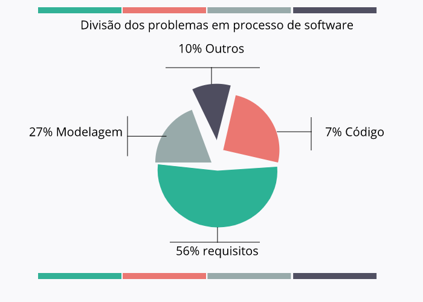

# Fatores, métricas e Garantia de Software

* Visão geral dos fatores que afetam a qualidade do processo e do produto.
* Medidas indiretas da qualidade de Software
* Conceitos e Atividades da SQA ( Garantia de qualidade de Software)
* Revisão de Software como prevenção
* Revisão técnica formal como meio de melhorar a qualidade do e do processo de desenvolvimento.

## Por que medir qualidade ?

## O que devemos medir ?
* Processo
* Produto

## Fatores que afetam a qualidade.
* Mensuráveis diretamente.
 * Tempo, custo, Produtividade.
* Mensuráveis indiretamente.
 * Usabilidade, Manutenabilidade.

 >#  " A qualidade precisar ser Medida e comparada com padrões e critérios pré determinados."

## Quais Medidas são necessárias ?
* Tempo e custo do processo.
* Desempenho e reusabilidade.
* Produtividade da equipe.
* Recursos efetivos usados.

## O que fazer com as medidas?
* Permitir criar padrões
* Estimar (Tempo, custo, Recursos)
* Aplicar ações preventivas e corretivas diante dos riscos.

## Fatores de qualidade

* Considerar no Software:
 * Características operacionais.
 * Capacidade de mudança.
 * Adaptabilidade a novos contextos.

* Categorias
 * Revisão do Produto.
 * Operação do produto.
 * Transição do produto.

#### Categoria Revisão:

Fator da qualidade | Característica
------------------ | --------------
Manutenabilidade | Capacidade de ajuste e melhorias do programa, mantendo-o atual.
Flexibilidade | Esforço para modificar o programa.
Testabilidade | Tempo para teste de um programa. Garantindo sua eficácia.

#### Categoria Operação:

Fator da qualidade | Característica
------------------ | --------------
Corretude | Atende as especificações e objetivos do cliente?
Confiabilidade | Executa sempre da mesma forma? Com a mesma precisão exigida?
Eficiência | Qtd de Recursos (HW e SW) para executar o programa.
Integridade | Controle de acesso.
Usabilidade | Esforço para aprender a usar o sistema.

#### Categoria Transição:

Fator da qualidade | Característica
------------------ | --------------
Portabilidade | Esforço para transferir o programa para outro ambiente.
reusabilidade | Uso do programa ou parte dele em outras aplicações.
Interoperabilidade | Esforço para integrar um sistema a outro.

### Como usar as métricas ?
Pressman cita sobre a dificuldade de desenvolver medidas diretas aos fatores de qualidades indicados por McCall.
> "Por que usar subjetvidade nas medição ?"

#### Influenciam a qualidade:
* Ausência de :
 * Modelo coorporativo de qualidade.
 * Procedimento de testes automatizados.
 * profissionais capacitados em qualidade.
*  Deficiencia de aplicação de testes.
* Qualidade aplicada tardiamente no processo.

#### Benefícios da qualidade :
* Ciclo de desenvolvimento de Software confiável.
* Garante ações corretivas no início do ciclo de desenvolvimento.
* Evita ingerência no projeto de Software.
* Amplia as chances do projeto de software.
* Amplia Produtividade no desenvolvimento.
* Evita propagação de erros.
* Automação de testes reduz custos do projeto.

## SQA - Garantia da qualidade de software
(Software quality assurance) deve ser:
* Aplicada em todo processo da engenharia de software. Avaliações auditorias e revisões.

* Define:
 * Padrões para projeto
 * Procedimento para relato.
 * Acompanhamento de erros e documentação necessária.
* Realimenta a equipe com conclusões do projeto.

### Atividades SQA

Número | Atividade | Finalidade
------ |--------- | ----------
1 | Aplicação de métodos e ferramentas técnicas | Aplicar a análise e projeto ajudam a analistas e projetistas a gerarem software com qualidade.
2 | Fator de Revisão técnica (FRT) | Descobrir problemas da qualidade do projeto. Tão importante quanto teste do software (produto).
3 | Teste de software | Dectar erro e falhas no software. Não é completo por si.
4 | Auditoria de padrões e Procedimentos formais | Verificar se os projetos cumprem padrões definidos. O desenvolvimento está usando padrões?
5 | Atividade de controle de mudança | Formaliza e controla pedidos de mudança no software. (No desenvolvimento e após manutenção).
6 | Medição de software | Coleta um conjunto de técnias orientadas a adminstração das especificações do software.
7 |Documentação | Manter acessível a documentação histórica dos resultados de toda atividade SQA aplicadas.

### Revisão de software
 * Método de validação da qualidade. usado por uma equipe técnica.
  * Processo
  * Produto
 * Filtram erros e inconsistência no processo de desenvolvimento.
 * objetivos
  * Apontar melhorias ao produto.
  * Tornar o trabalho técnico mais adminstrável.

#### Tipos de Revisão de software  

* Inspeções od projeto ou do programa.
 * Decta erro nos requisitos, projeto ou código.
* Revisões de progresso.
 * Informações para gestão do progresso geral do projeto.
   * Revisão do processo, produto, custos, prazos, planejamento, prazos.
* Revisões da qualidade
 * Análise técnica do produto ou documentação.
 * Dectar inconsistência entre :
   * especificação e projeto.
   * Código e documentação.
   * Assegurar se os padrões de qualidade foram seguidos.

   

#### Custo de qualidade

* Custo operacionais de implementação das atividades de qualidade no processo e produto.

* Metas:
 * Reduzir custos com qualidade.
 * Comparar com demais custos.
* 4 Categorias de classifação de custos

| Categorias de classificação de custos
| -------------------------------------
| Custo de prevenção defeitos (5% a 10%)
| Custos de avaliação (Remover dos processos produtos com defeitos). 20% à 25%.
| Custos com falhas internas. Defeitos antes de entregar ao clientes. 65% à 70%.
| Custos com falhas externas. Defeitos depois de entregar ao clientes. 65% à 70%.

#### Custos da revisão e seus impactos:

Custos de prevenção | Custos de avaliação
------------------- | -------------------
 Atividades deccorrentes: | Atividades deccorrentes:
Planejamento  da qualidade. | Inspeção intra e interprocessos.
Revisões técnicas formais | Calibração e manutenção de equipamentos
Treinamento | teste
São controláveis e caracterizam investimento | são **incontroláveis** e caracterízam perdas e prejuízos.

Custos de falhas internas | Custos de falhas externas
------------------------- | -------------------------
Trabalho para refazer | Solução de queixas
Esforço para reparar | Devolução e substituição do produto
Análise do modo como a falha ocorreu | manutenção da linha de suporte.
São controláveis e caracterizam investimento | são **incontroláveis** e caracterízam perdas e prejuízos.

### Revisão técnica formal
Principal atividade da SQA:
#### Objetivo :
* Verificar se o software atende aos requisitos.
* Garantir se o software está dentro dos padrões definidos.
* Obter o software desenvolvimento de maneira uniforme.
* Tornar projetos mais adminsistráveis.
* Descobrir erros de função, lógica ou implementação do software.

> 

> > Conhecido como walkthrough > Passo à passo

Diretrizes para revisão
* Revise o produto, não o produtor.
* Fixe e mantenha agenda.
* Limite o debate e a réplicar
* Enuncie áreas problemáticas, porém não tente resolver cada problema anotado.
* Limite Número de participante e insvista numa preparação antecipada.
* Realize treinamento para todos os revisores.
* Reveja as primeiras revisões.

## Conclusão

Custo de identificação e reparo, defeito e erro aumenta a proporção que o tempo passa.
Aumenta a insatisfação interna e externa.
# Dica : Investir em prevenção.
