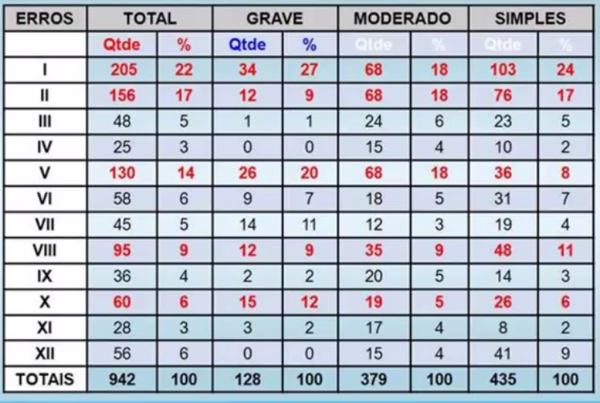
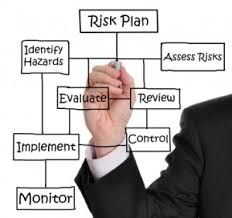

# Qualidade de Software
## SQA Estatítico e norma ISO 9000

* SQA estatística - Garantida da estatística da qualidade.
* Mais métricas de qualidade
    * Confiabilidade
    * Segurança
* Normas ISO 9000
* Como empresas certificam-se ?

> "  Qualidade do processo implica na qualidade do produto "

## Garantia estatística de qualidade

* A qualdade é responsabilidade de **todos** os participantes do desenvolvimento de software.

* Qualidade pode ser obtidade
    * Processo eficiente (Analise, Projeto, Codificação e teste)
    * RTF (Revisão técnica formal) nos trabalhos intermediários.
    * Modificações propostas
* SQA Estatítisca -> Apoio quatitativo
    * Base : Frequência de ocorrência de erros e inconsistencias, ao longo do período de tempo.
    * Objetivo: Aprimorar os elementos do processo que promovem erro:

### PASSO A PASSO PARA A SQA Estatística

1. Coletar informaões sobre os defeitos e catalogar categorias.
    1.1 Alguns defeitos - no processo
    1.2 Outros defeitos - após entrega
2. Rastrear o defeito até encontrar sua causa.
3. Considerar: 20% do código tem 80% dos defeitos.  **Centrar no que importa**.
4. Corrigir os problemas que originaram os defeitos.

#### Possíveis causas dos defeitos

1. Especificações incompletas ou mal formuladas.
2. Má interpretação da comunicação com cliente.
3. Desvio intencional das especificações.
4. Violação dos padrões da programação.
5. Erro na representação de dados.
6. Inconconsistência na interface de componente.
7. Lògica do projeto inconsistente.
8. Teste incompleto ou errôneo.
9. Documentação imprecisa ou incompleta.
19. Erro na tradução do projeto para linguagem.
11. Interface Homem máquina ambígua ou inconsistente.
12. Diversos.

Erros | Total | Grave | Moderado | Simples
----- | ----- | ------|----------|--------
| | Qtd |

Addicionar tabelas.

#### O que a tabela diz?
* Os erros, 1, 2 e 5 - Poucas causas vitais que correspondem a 53% dos erros (Some a coluna Tota % desses 3 grupos de erros).
* Os erros 1,5,7 e 10 - Poucas causas vitais de erros graves ( Conluna qtd de Graves)
* Após detecção dos erros vitais -> Ação corretiva -> novos erros aparecerão.

#### Procedimento - SQA Estatística.

Repetir os passos até que erros sejam sanados.

1. Criar lista de possíveis categorias de Causas.
2. Quantificar, por um tempo determinado, a incidência de erros.
3. Focar nas poucas causas vitais.
    * 20% do projeto/código contem 80% dos erros
4. Corrigir as causas vitais -> Corrigir os erros.
5. Surgem novos erros (Testes são exaustivos).

## Métrica Confiabilidade

Probabilidade de um programa operar sem falhas num ambiente específico, durante determinado tempo específico.

* Considerar número mínimo de falhas ocorrerá na execução
* Alguns softwares precisam de % confibialidade próximo a 100%.

> 0,98 confiabilidade por 8h de processamento.
>> Se o software for executado 100x por um período de 8 horas é provavel que ele funcione corretamente 98x

* Alta Disponibilidade do software.

## Métrica Segurança

* Sistema de segurança Crítico.
* Trata-se uma atividade SQA
    * Detecta e avalia risco em potencial que podem provocar falhas e impactar em desempenho.
        * Quais são as vunerabilidades de meu sistema?
        * Quais são os eventos que podem acontecer ue afetam a vunerabilidade.
        * Quais são os percentual de incidencia de força que esse evento tende a acontecer.
    * Identifica e avalia casualidades em potencial que possam exercer impacto negativos e provacar falhar.
        
    

### Planos para implementação de segurança

* **MONTAR PLANO DE RISCO**
    
Regras princípios de segurança que garantam a ocorrêcia do evento.

1. Identificar a presença de risco o mais cedo possível.
2. Traçar estratégias no projeto que eliminem ou controlem os riscos em potencial.
3. Identificar e avaliar casualidades que podem impactar negativamente.
4. Analisar a gravidade e a probalidade de ocorrencia.
5. Listar requesitos de segurança para o software.