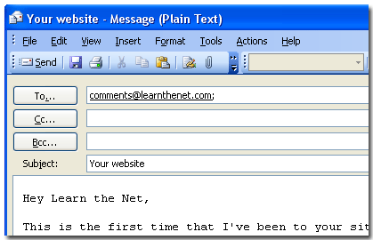
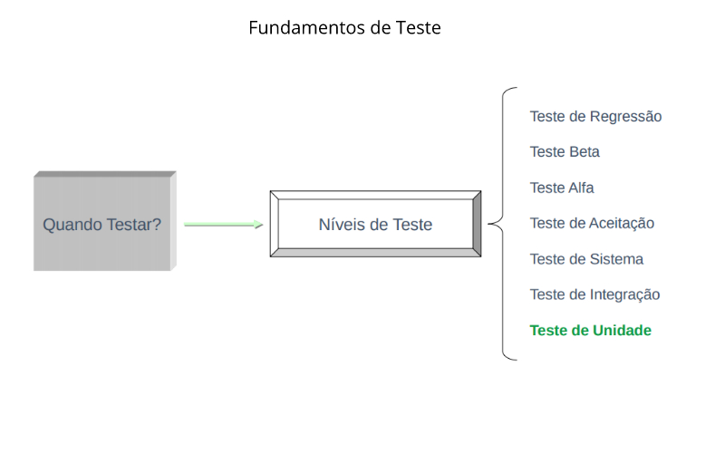
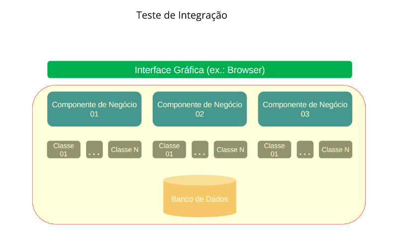
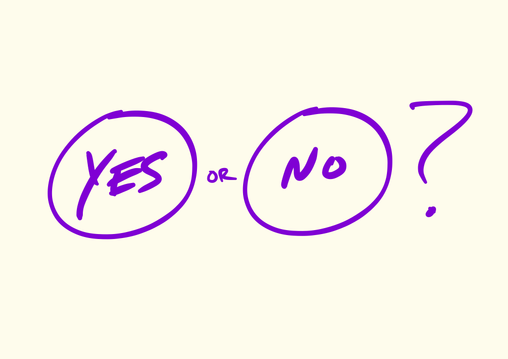
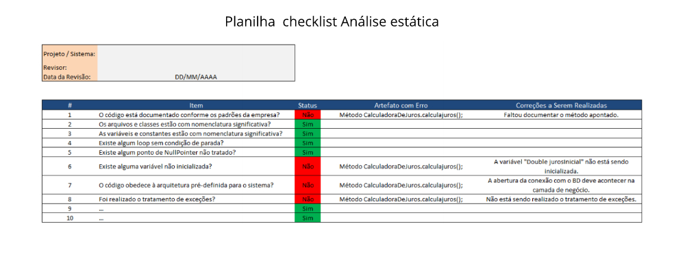

# Fundamentos em testes de software

Constantemente testamos coisas na vida


## O que é teste de software?
> " Verificação feita sobre um sistema ou parte dele para garantir que uma determinada entrada produza, **sempre**, uma saída esperada.

> **IUPIIIIIIII**


### Exemplos do que se esperar
##### Ex1: Tranferencia bancária


##### Ex2: Post no facebook


##### Ex3: Envio de e-mail


> Conceito de teste é o mesmo de quando testamos outras coisas, porém em nosso caso específico é software.


### Verdades sobre testes
1. Testes não verificam completamente as saída de um sistema, pois as entradas são infinitas

2. Testes não garantem qualidade.
3. Teste custam em média 20% a 30% dos custos de elaboração de um software.

### Problemas por falta de testes
#### Caso Tríade UNEB


#### Caso ARIANE 5


* Projeto Agência Européia Especial
    *  10 Anos de trabalho.
    * Investimento de US$ 8 bilhões
* Vôo programado para 1996
* Carga de US$ 500 milhôes 
* Explodiu 40''


#### Caso Quase 3 Guerra


##  A situação das empresas

* Prazos apertados para entrega de sistemas
* Clientes menos tolerantes a atrasos nas
entregas
* Precisam lançar software de boa qualidade
* Clientes menos tolerantes a falhas

# Fundamentos de teste de software
* Níveis de Testes (Quando testar ?)
* Técnicas de Testes (Como Testar ?)
* Tipos de Testes (O que testar ?)


## Níveis de teste



### Teste de unidade

* **Objetivo:** encontrar falhas de funcionamento dentro de uma pequena parte do sistema funcionando independentemente do todo  

* **Quem Executa:** Programador.  

* **Alvo:**  subrotinas, métodos, classes, i.e., as menores unidades do sistema
* Geralmente é automatizado, através de ferramentas como junit, PHPunit
* Pode ser realizado antes do sistema esta concluído.


```java
 import junit.framework.TestCase;
 /**
 * Teste de unidade para classe pessoa
 */
 public class TestCarro extends TestCase{
     /**
     * Um teste para avaliar se a placa do carro esta formatada corretamento
     */
     public void testObterPlaca(){
         Placa p = new placa("JKL", 4709);
         assertEquals("JKL-4709", p.getPlacaCarro());
     }
 }
```

### Teste de Integração

* **Objetivo:** validar a comunicação entre os componentes de um sistema
* **Quem executa:** Programador
* **Alvo:** funcionalidades que envolvem a integração de componentes.
* Geralmente é automatizado, através de ferramentas como junit, PHPunit
* Pode ser realizado antes do sistema esta concluído.



### Teste de Sistemas

* **Objetivo:**  executar o sistema sob ponto de vista de seu usuário final, varrendo as funcionalidades em busca de falhas em relação aos objetivos originais
* **Quem executa:** Equipe de teste
* **Alvo:** Cenários de teste coerentes com os requisitos especificados para o sistema.
* Geralmente é automatizado, através de ferramentas como junit, PHPunit
* Será realizado **após** do sistema esta concluído.


Exemplo


### Teste de Aceitação

* **Objetivo:**   executar o sistema sob ponto de vista de seu usuário final, varrendo as funcionalidades em busca de falhas em relação aos objetivos originais.
* Planejados e executados por um grupo restrito de usuários finais do sistema, que simulam operações de rotina do  sistema de modo a verificar se seu comportamento está de acordo com o solicitado.
* Visa permitir ao cliente determinar se aceita ou não o sistema.
* Pode incluir testes funcionais, de recuperação de falhas, de segurança e de desempenho.


Aceita ou não aceita
#### Arquitetura


### Teste de Alfa

* **Objetivo:**   executar o sistema de forma não planejada, sob ponto de vista de seu usuário final, porém, apenas por um grupo **pequeno** de pessoas.

* O grupo restrito de usuários que testarão geralmente é composto por membros da própria organização e também do cliente.
* Visa a identificação de possíveis erros não detectados até o momento, encontrados enquanto mais usuários finais utilizam o sistema de forma natural, não planejada.
* Representantes do time de programadores irão acompanhar de perto estes testes para coletar possíveis falhas a serem corrigidas e melhorias a serem implementadas.


### Teste de Beta

* **Objetivo:**   executar o sistema de forma não planejada, sob ponto de vista de seu usuário final, porém, por um grupo **grande** de pessoas.
* Representantes do time de programadores **não** irão fazer acompanhamento e coleta de erros. No teste Beta, os usuários é que reportam os erros encontrados.


### Teste de Regressão

* **Objetivo:**    reexecutar testes após alterações serem realizadas no sistema, para conferir se tudo continua funcionando corretamente (detectar efeitos colaterais):

* Após mudanças de regras durante o desenvolvimento
    *  Ex.: youtube agora permite a postagem de vídeos 3D.
    
* Após a correção de uma falha encontrada
* Após a implementação de melhorias para lançamento de novas versões.


## Técnicas de testes ( Como testar ?)


# Teste Automáticos x Testes Manuais


Teste Manuais | Teste Automáticos
------------- | ----------------- 
Velocidade de execução baixa |  Execução muito rápida
Repetitivo e Cansativo | Não cansam e não sentem preguiça.
Não exige tecnologias | Exige domínio de tecnologias específicas.
Alto custo a cada execução | Alto custo apenas na criação
Possuem limitações quando o teste envolve situações de grande paralelismo | Permite testar  situações impossíveis de testar manualmente
Podem explorar além do cenário de teste, quando necessário | Faz apenas o programado para fazer.
Podem avaliar questões visuais como cores e formas | Não avaliam questões visuais. 
Podem avaliar questões de usabilidade | Não avaliam questões de usabilidade.

# Teste Estático x Teste Dinâmico

### Teste Estático

**Objetivo:** analisar o código sem executá-lo e verificar se as boas práticas adotadas foram obedecidas.  
* Obviamente é um teste “Caixa Branca”
* Existem ferramentas que fazem este teste automaticamente **Ex.: Findbugs**
* Exemplos de verificações realizadas:
* Código está documentado?
* Variáveis e constantes possuem boa nomenclatura?
* Código está organizado e com boa legibilidade?
* Existem possíveis NullPointers não tratados pelo programador?
* O programador obedeceu à arquitetura do sistema ao codificar?
* As conexões com o banco de dados estão sendo fechadas após utilizadas?


[Dowload Planilha - checklist](../cenarios/AnaliseEstatica/Checklist.xlsx)

### Teste Dinámicos

**Objetivo:** validar o sistema através de sua execução
* É o método tradicional: insere uma entrada, executa o sistema e confere a saída.
* As análises estáticas e dinâmicas se complementam
