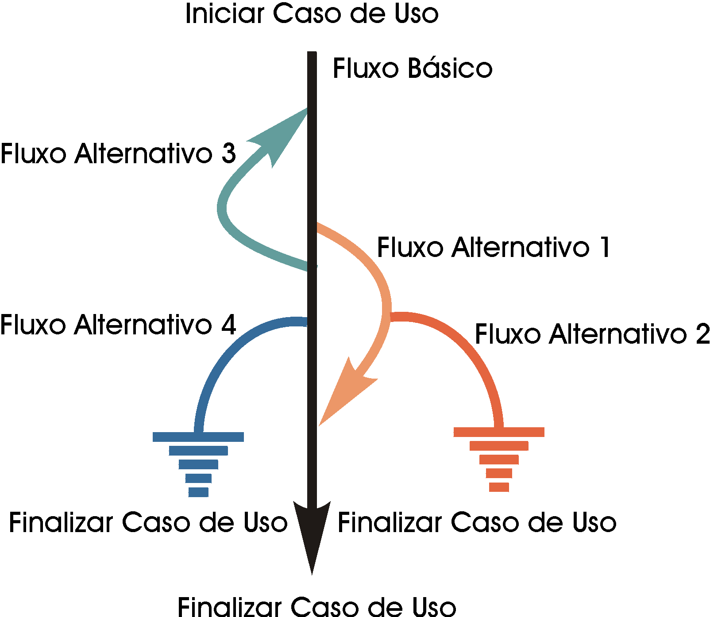

# Artefatos e Documentos de planejamento de testes

# Ciclo de vida ( Processo de softwares)

# " 
>  Segundo Craig e Jaskiel (2002), estes artefatos do processo de teste de software podem ser definidos da seguinte forma:
# "

Caso de teste e Procedimento de testes.

### Padronização documentação
Documento : [IEEE-Std-829](https://standards.ieee.org/findstds/standard/829-2008.html)

Na verdade, o padrão IEEE-Std-829 foi proposto exatamente com o intuito de servir como base para que empresas de software pudessem definir o seu roteiro de documentos para as atividades de teste de software. 

Cada organização possui suas especificidades e isso precisa ser refletido no roteiro utilizado para documentar suas atividades de teste.

## Caso de teste
Descreve uma condição particular a ser testada e é composto por valores de entrada, restrições para a sua execução e um resultado ou comportamento esperado.

A identificação dos casos de teste é importante por vários motivos:

* Os casos de teste constituem a base do design e do desenvolvimento dos Scripts de Teste.

* A "profundidade" do teste é proporcional ao número de casos de teste. O aumento do número de casos de teste gera uma maior confiança na qualidade do produto e no processo de teste, já que cada caso de teste reflete um cenário, uma condição ou um fluxo diferente através do produto.

* A principal avaliação da abrangência do teste é a cobertura baseada em requisitos, de acordo com o número de casos de teste identificados, implementados e/ou executados. Uma sentença como "Executamos e verificamos 95% dos casos de teste críticos" é mais significativa do que a sentença "Já executamos 95% do total de testes".

* A escala do esforço de teste é proporcional ao número de casos de teste. Com uma análise abrangente dos casos de teste, é possível estimar com mais precisão a duração dos estágios subseqüentes do ciclo de teste.

* Os tipos de design e desenvolvimento de testes e os recursos necessários são amplamente controlados pelos casos de teste.

##### Exemplo Documento caso de teste

## Cenário de Teste:

O cenário de teste é um documento que descreve estórias (situações de teste) que ajudam no trabalho do testador no momento de execução destes testes. O cenário de teste descreve "o que" deve ser testado, **diferentemente do caso de teste**, que descreve "como" deve ser testado.

## Plano de teste
É uma descrição dos passos necessários para executar um caso (ou um grupo de casos) de teste.

### Técnicas casos de teste por Tabelas de decisão.
Requisito : Alunos podem pertencer ao nível de ensino colegial ou ao nível superior. OS pertencentes aos colegial podem estar alocados nas turmas de 1º, 2º  ou 3º ano. já os pertencentes ao nível superior podem ser alocados nas turmas de 1º, 2º ,3º ,4º ou 5º.
Quando Colegial o título na página será "Colegial" e quando nível superior será "superior". A partir do 4 ano é oferecido ao aluno a possibilidade de ter acesso ao curso de especialização.

1. Requisito:
2. Atributos de entrada : Nível de ensino e turmas
3. Atributos de saída : Titulo da página, possibilidade de ter acesso e **resultado (implicito)**

##### Decomposição em classes de equivalência:

* **Válidas**
* **Inválidas vazias**
* Inválidas negativas
* ETC

##### Identficação de classes de equivalência:

**Entradas:** 
Nível de ensino: [Colegial,Superior,Vazio]
Turma [1º, 2º ,3º ,4º, 5º, vazio]

**Saídas**
Título: [Colegial, Superior]
Acesso a especialização: [Sim, Não]
Resultado: [Sucesso, erro]

##### Decomposição em Caso de teste [**Permutação**]: 
Quantidade de teste é igual a 3 x 6  18 testes
Combinação de todas as classe de entrada

Caso de teste 1
**Entrada**
Nível: Colegial
Turma: 1

**Saída**
Titulo: Colegial
Acesso à especialiação : Não
Resultado: Sucesso

# Ferramentas
[X | Decision](http://juliodelima.com.br/xdecision/pt)
[Plano de Teste de softwa](../cenarios/F045ADSPlanoTesteSoftwarev5.doc)

#### REFERÊNCIAS
* http://www.funpar.ufpr.br:8080/rup/process/modguide/md_tstcs.htm

* http://www.devmedia.com.br/casos-de-teste-aprimore-seus-casos-e-procedimentos-de-teste/30526
* http://www.cce.ufpr.br/pds-ufpr/ProcessoDemoisellePlugin/capabilitypatterns/casoDeTeste_EFEA866A.html