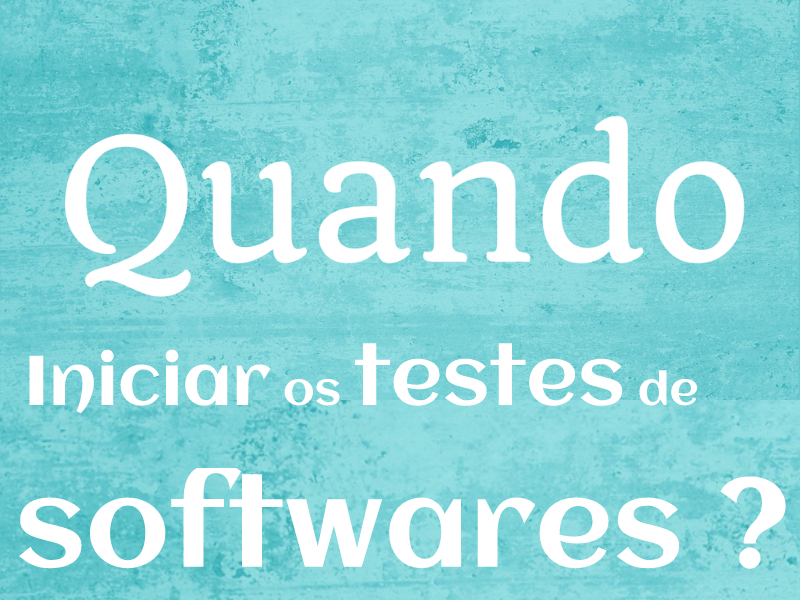
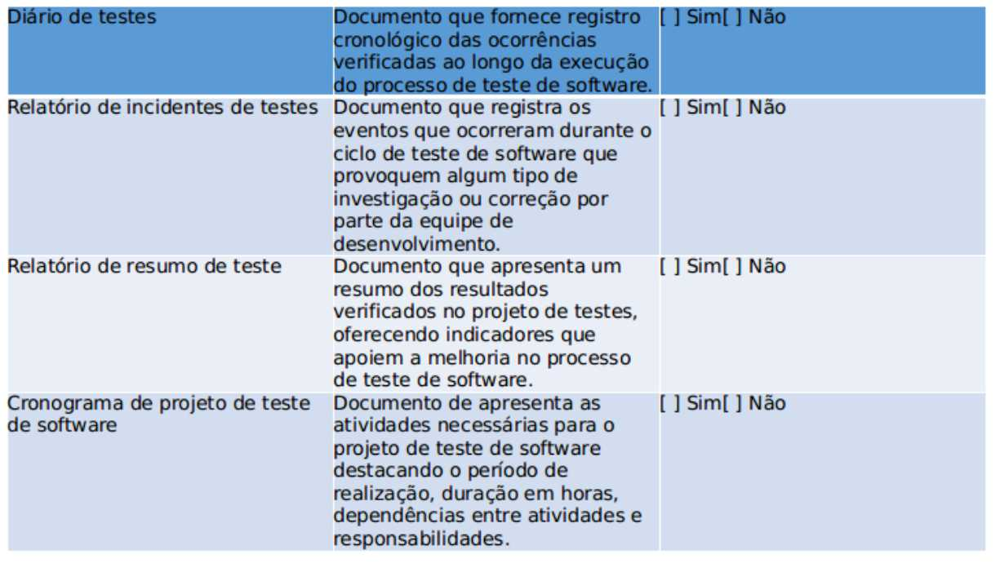
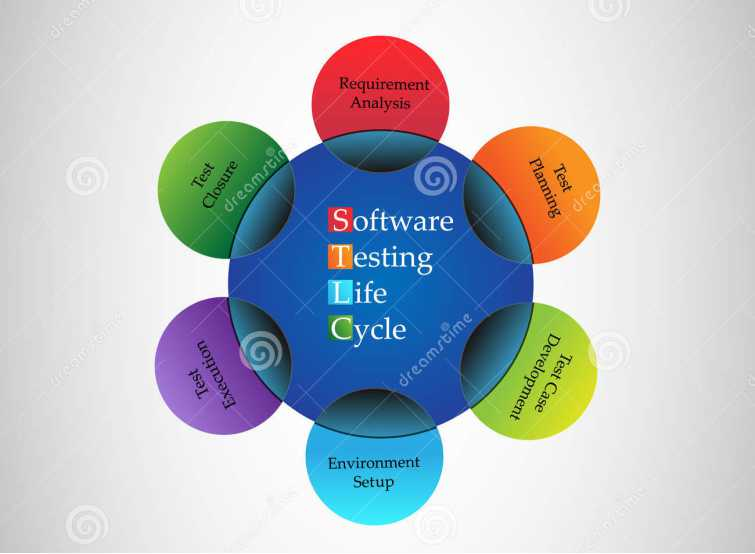
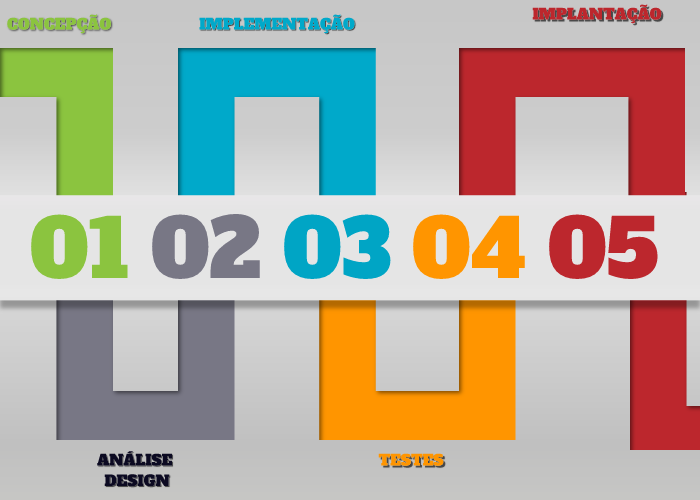
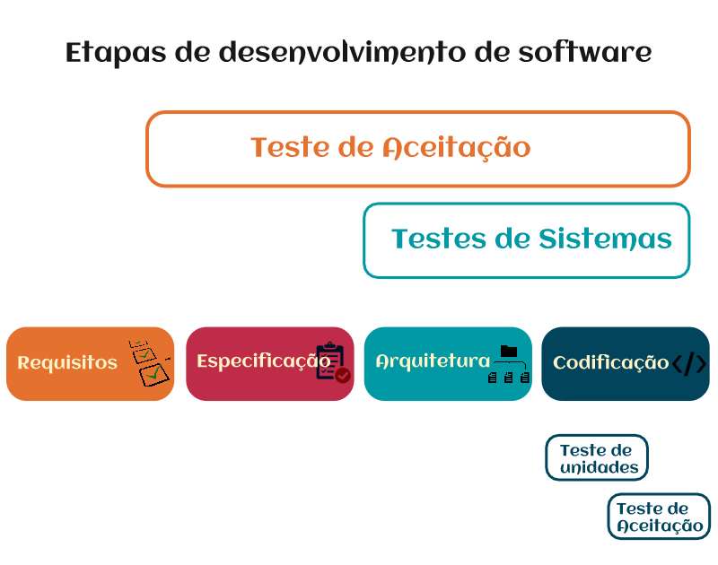
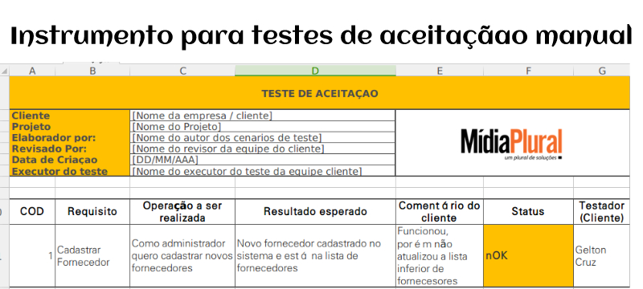

# Processo de teste de softwares
## E quando começa o processo de teste de software?

* Um software vem de uma ídeia
* Nem sempre quem tem a idéia tem habilidades para desenvolve o software.
### A idéia deve ser passada para um desenvolvedor (Analísta, time), para que se concretize.

### Para que a ideia original seja transformada em produto é necessário boa comunicação

### Para atender a necessidade do steakholder

### Etapas de desenvolvimento de software

### Criação do cenário de teste e aplicação dos testes

## Teste de aceitação

* Teste que enxergam o sistema do ponto de vista do usuário
* Foco do teste é a verificação se os critérios de avaliação foram atendidos.

### Instrumento para teste de aceitação Manual

COD | Requisito | Operação a ser realizada | Resultado esperado | Comentário do cliente | Status | Testador (Cliente) 
--- | ------- | ------------------------ | --------- | --------- | ---------- | ----- 
001 | Cadastrar Fornecedor |  Como administrador quero cadastrar novos fornecedores | Novo fornecedor cadastrado no sistema e está na lista de fornecedores | Funcionou, porém não atualizou a lista inferior de fornecesores | nOK | Gelton Cruz 

